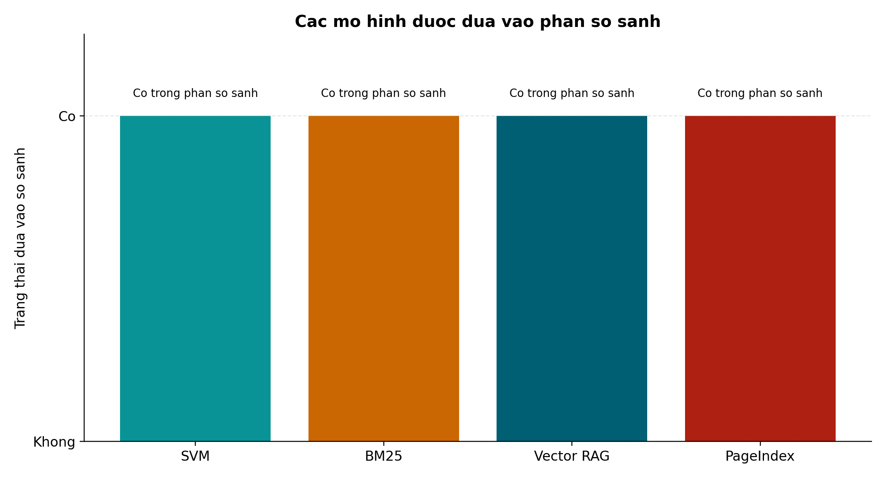
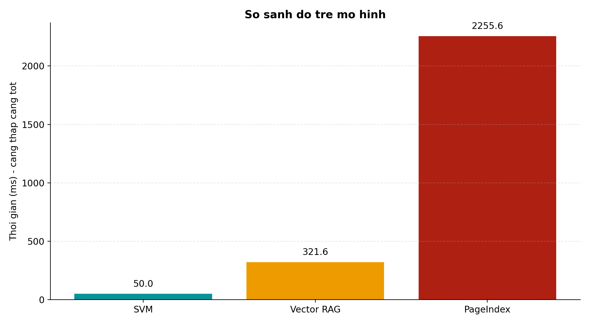
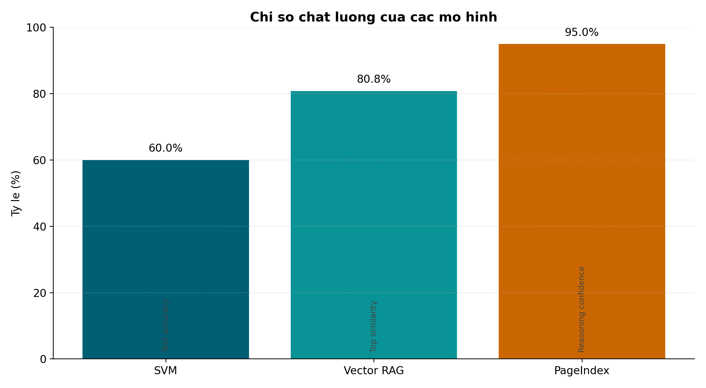
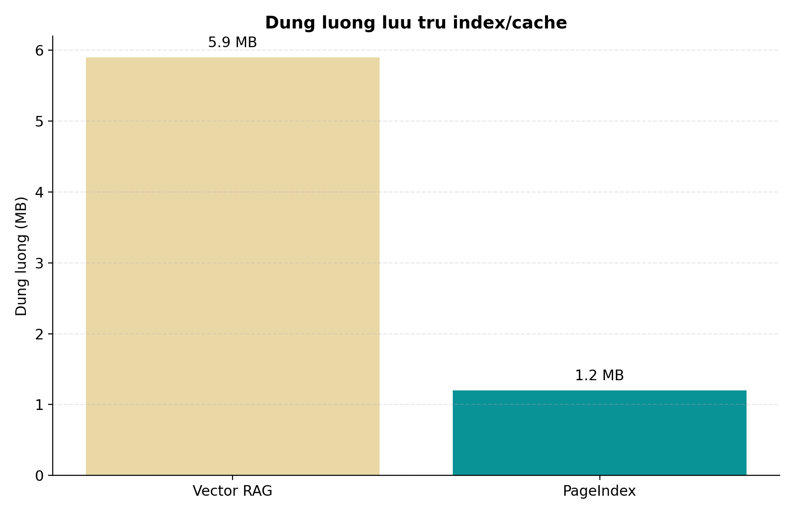
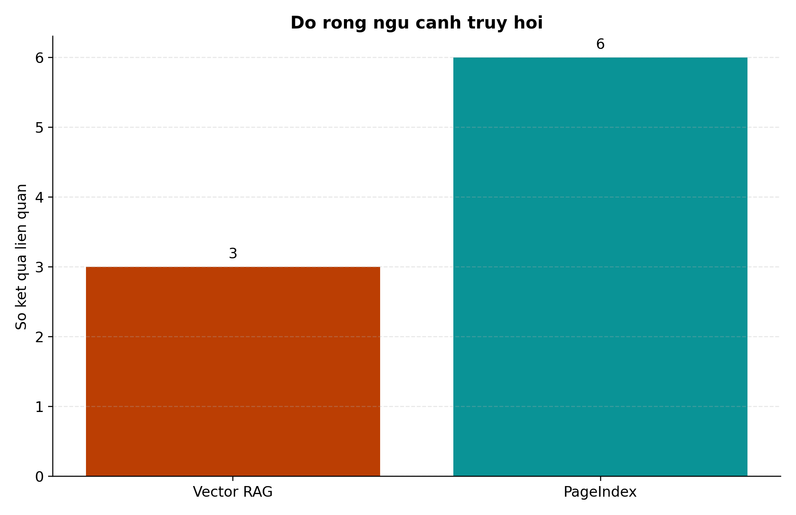
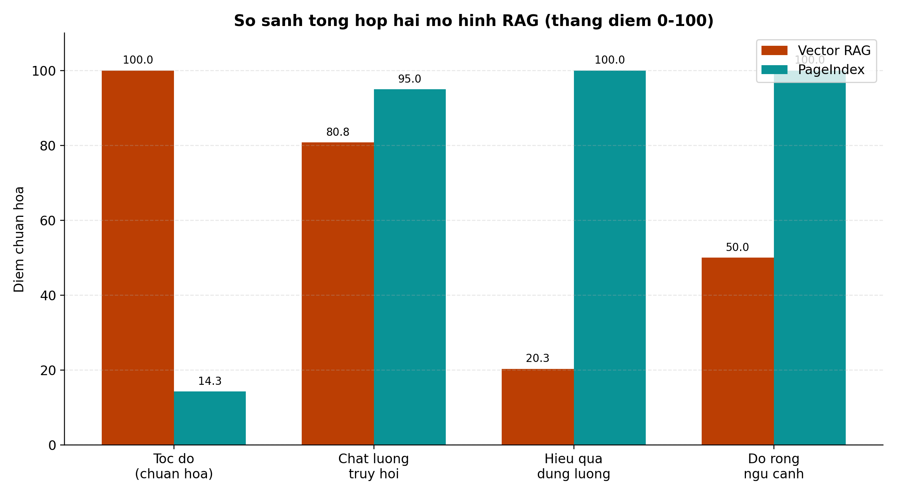

# Bao Cao Mo Hinh Day Du (Ban Tieng Viet)

Muc tieu: Tong hop cac mo hinh duoc su dung trong du an, so sanh va chen hinh theo thu tu de dua vao bao cao do an.

## A. Ket qua quet he thong (toan du an)

### A.0 Tom tat nhanh: mo hinh nao lam gi va du an dang dung gi

| Mo hinh | Nhiem vu chinh | Trang thai trong codebase | Trang thai trong backend app.py (dang chay) |
|---|---|---|---|
| SVM + TF-IDF | Phan loai loai hop dong, danh gia nhom rui ro/co vi pham | Co | Co (lay `svm_results` trong luong phan tich) |
| BM25 | Truy hoi van ban phap ly theo tu khoa (keyword matching) | Da go bo khoi runtime | Khong su dung (chi giu de so sanh hoc thuat) |
| Vector RAG (embedding) | Truy hoi semantic bang embedding + cosine similarity | Da go bo khoi runtime | Khong su dung (chi giu de so sanh hoc thuat) |
| PageIndex | Truy hoi theo cau truc cay + suy luan LLM (de giai thich) | Co | Co (duoc goi trong workflow ma `app.py` invoke) |

Ket luan 1 dong de dua vao bao cao:
- Voi phien ban van hanh hien tai, he thong su dung SVM + PageIndex; BM25 va Vector RAG duoc giu trong phan so sanh mo hinh de giai trinh ly do lua chon kien truc.

### 1. SVM
- Co su dung SVM de phan loai hop dong trong he thong.
- Dau vet chinh:
  - backend/ml_models.py (ham get_svm_classifier)
  - backend/app.py (lay svm_results tu workflow output)
  - SVM_RAG_DOCUMENTATION.md (mo ta chi tiet hyperparameter va metric)

### 2. BM25
- BM25 duoc giu o muc tham chieu hoc thuat de so sanh.
- Khong con tham gia luong van hanh runtime hien tai.

### 3. Vector RAG
- Vector RAG duoc giu o muc tham chieu hoc thuat de so sanh.
- Khong con tham gia luong van hanh runtime hien tai.
- Nguon so sanh/benchmark: SVM_RAG_DOCUMENTATION.md va backend/PAGEINDEX_DOCUMENTATION.md.

### 4. PageIndex
- Co su dung PageIndex (tree-based retrieval + LLM reasoning).
- Dau vet chinh:
  - backend/pageindex_rag.py
  - backend/PAGEINDEX_DOCUMENTATION.md
  - backend/simple_api.py (get_pageindex_retriever va endpoint pageindex-search)

## B. Thu tu anh bao cao (xuat theo 01 -> 06)

1. 
2. 
3. 
4. 
5. 
6. 

## C. So sanh mo hinh (noi dung chen vao chuong danh gia)

| Mo hinh | Vai tro | Uu diem | Han che | Khi nen dung |
|---|---|---|---|---|
| SVM + TF-IDF | Phan loai hop dong | Nhanh, de trien khai, it tai nguyen | Accuracy phu thuoc data train | Phan loai nhanh real-time |
| BM25 | Truy hoi theo tu khoa | Tot voi legal keyword, don gian, de giai thich | Kem hon semantic khi query dien dat tu do | Can truy hoi dung thuat ngu phap ly |
| Vector RAG | Truy hoi semantic bang embedding | Can bang toc do va chat luong | Chi phi embedding/index | He thong can phan hoi nhanh |
| PageIndex | Truy hoi theo cau truc + suy luan | Giai thich tot, chat luong cao | Do tre cao do goi LLM | Bai toan can do tin cay cao |

## D. Ket luan ngan gon cho slide

1. Du an trinh bay so sanh 4 huong mo hinh (SVM, BM25, Vector RAG, PageIndex) de ly giai quyet dinh kien truc.
2. Khong co mo hinh nao tot nhat tuyet doi; can phoi hop de toi uu ca toc do, do chinh xac va kha nang giai thich.
3. Trang thai van hanh hien tai: SVM + PageIndex la luong chinh trong `app.py`; BM25 va Vector RAG chi giu vai tro so sanh trong bao cao.

## D.0 Pham vi su dung hien tai (de tranh hieu nham khi bao ve)

- Dang chay thuc te trong backend chinh (`app.py`): SVM + PageIndex.
- BM25 va Vector RAG: da loai bo khoi runtime; chi giu trong noi dung so sanh de bao cao va bao ve.
- Vi vay, khi trinh bay nen tach ro 2 muc: "mo hinh dem ra so sanh" va "luong dang van hanh mac dinh".

## D.1 Ly do chon PageIndex thay vi chi dung Vector RAG

Trong bai toan phap ly, muc tieu khong chi la tim nhanh ma con phai tim dung ngu canh va de giai thich. Vi vay, PageIndex duoc uu tien trong cac truong hop can do tin cay cao.

### 1) Do giai thich tot hon
- Vector RAG tra ve ket qua dua tren diem similarity (kieu "hop ngu nghia"), kho giai thich duong di truy hoi.
- PageIndex truy hoi theo cau truc cay tai lieu, co buoc suy luan theo tung muc, de trinh bay cho giang vien/nguoi dung vi sao ket qua duoc chon.

### 2) Phu hop tai lieu phap ly co cau truc
- Van ban luat co chuong, muc, dieu, khoan ro rang.
- PageIndex tan dung cau truc phan cap nay de dinh vi dung pham vi, tranh lay nham doan van ban co tu giong nhau nhung sai ngu canh.

### 3) Chat luong truy hoi cao hon trong benchmark noi bo
- Theo tai lieu noi bo, PageIndex dat confidence cao hon (95%) so voi Vector RAG (top similarity 80.8% trong test query duoc ghi nhan).
- Doi voi bao cao phap ly, sai lech ngu canh nho cung co the gay ket luan sai, nen uu tien do tin cay.

### 4) Dung luong index nho hon
- So lieu tai lieu noi bo: cache cay cua PageIndex nho hon index embedding cua Vector RAG.
- Loi the nay huu ich khi trien khai tren may cau hinh trung binh.

### 5) Danh doi can chap nhan
- Nhuoc diem chinh cua PageIndex la do tre cao hon.
- Cach dung hop ly trong he thong: 
  - Truy van thuong/xu ly nhanh: uu tien Vector RAG.
  - Truy van can lap luan, can trich dan chat che: uu tien PageIndex.

### Cau chot de dua vao slide
"PageIndex khong thay the hoan toan Vector RAG, ma bo sung cho cac tinh huong can do giai thich va do tin cay cao trong mien phap ly."

## E. Nguon so lieu benchmark

- SVM_RAG_DOCUMENTATION.md
- backend/PAGEINDEX_DOCUMENTATION.md

Luu y hoc thuat:
- Cac metric giua mo hinh khong dong nhat (accuracy, similarity, confidence).
- Trong bao cao nen neu ro day la so sanh he thong (system-level comparison), khong phai benchmark cung metric.
